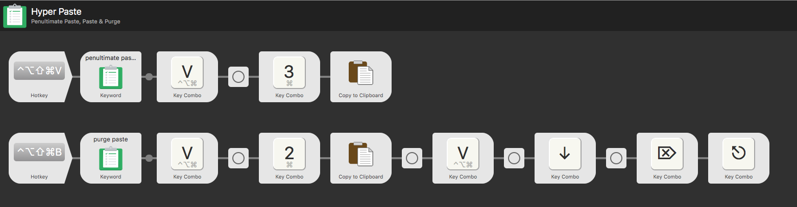

# Alfred Workflows 

Here are some [Alfred App](https://www.alfredapp.com) workflows I use regularly. Only tested on v3 of the app. 

## Hyper Paste

This workflow adds a couple new global paste functions to macOS. Generally run this with hotkeys to do a specialty paste.

### Uses

**Penultimate Paste (pasting second last item)** - this function allows you to paste the second last thing in your clipboard (easier than triggering clipboard history, then ⌘+2). This promotes that item to the most recent item in your clipboard. There are several uses for this:
  - if you thought you were pasting a helpful code snippet, but in fact pasted a link to a cat video, this is your mulligan! _(I can't be the only person this happens to constantly)_
  - if you needed to alternately paste, for example your name and email into several documents repeatedly.
  - when you get used to this being here you start to actively plan on using it; fearlessly and constantly copying multiple things to clipboard.

**Paste & Purge (paste then remove)** - in addition to pasting your clipboard contents into your active application, Alfred afterwards removes it from the clipboard entirely (this is done with timed delays which is a bit hacky, but is the only way to pull this off). Use cases: 
  - If you want a handy way to remove something from your clipboard (could be stealth reasons, or to clean up your current clipboard for a 'mass paste').
  - Mass pasting: being able to paste many items without fussing about navigating through clipboard history with arrow keys or ⌘+numbers. For example; if I have a dozen tabs open that I need to send the URLs of, I can copy+close tab a dozen times, then destructo paste a dozen times and be done with it.

> A screenshot of how I have this workflow configured

### Requirements, Setup & Notes

- Requires an Apple computer
- Requires Alfred App v3
- When importing a workflow certain items are empty. Populate the triggering hotkey. You can see in the screenshot that I use Hyper+V and Hyper+B; use what you like. To use Hyper in your hotkey _(command+alt+ctrl+shift)_ you may need an application like [Karabiner Elements](https://github.com/tekezo/Karabiner-Elements) _(at the time of writing Hyper is only functional on beta, [more info](https://github.com/tekezo/Karabiner-Elements/pull/170#issuecomment-308121709))_
- Populate the Key Combos - In the screenshot you can see I use cmd+alt+ctrl+v - find your setting in Alfred: _Features > Clipboard > Viewer hotkey_

***

## Alfred Says (WIP)

A utility to dump the contents of a text file to audio file. Generally runs as a file filter like `o my-file.txt`, then the action control, then select `say`. 

### Uses

There are many times when listening to something is more easily done than reading (like when commuting). Text To Speech is great, and the macOS `say` application is so powerful. Customize this workflow with flags to change the voice, speed, language. Read more on [Apple's manual for say](https://developer.apple.com/legacy/library/documentation/Darwin/Reference/ManPages/man1/say.1.html). 

### Requirements, Setup & Notes

- Requires an Apple computer
- This is a file filter; see what your shortcut is set to in Alfred App under _Features > File Search > Actions_
- Audio files are saved in the same directory as your text file.
- You can run `say` as an Alfred command which saves the argument as an aiff on the desktop; which has been useful for testing.
- You may want to edit the speeds in the workflow; -r is the flag that sets the rate; higher number is greater speed.
- Download more voices in macOS in _System Preferences > Accessibility > Speech > in the voice dropdown: Customize_
- Voices are fun; investigate as above, or quick test with: `Kathy, Vicki, Ralph, Albert, Cellos, Hysterical, Trinoids, Zarvox, Whisper`. e.g. `say -v Kathy "site build complete"`
- It seems that not every voice can have speed adjusted.
- Outputs to aiff. You could comvert to mp3 from the command line with [ffmpeg](http://ffmpeg.org/). You would edit the workflow to have additional commands like `&& ffmpeg -i my-file.aiff -f mp3 -acodec libmp3lame -ab 192000 -ar 44100 my-file.mp3 && rm my-file.aiff`
- Known issue: sometimes this utility acts up. I think spaces in file names may be an issue.
